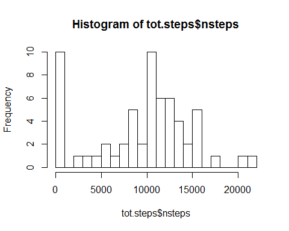
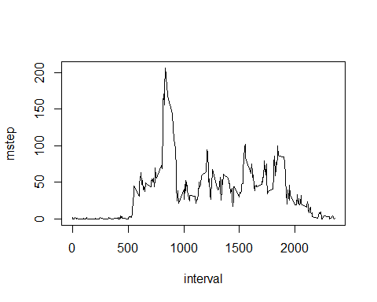
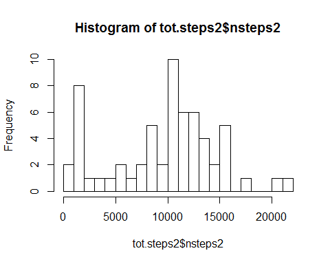
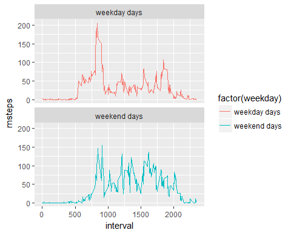

# Reproducible Research: Peer Assessment 1
Dan Han  


## Loading and preprocessing the data


```r
## read in and examine the data
unzip(paste0(getwd(), "/activity.zip"))

df <- read.csv("activity.csv", stringsAsFactors = F)
head(df)
```

```
##   steps       date interval
## 1    NA 2012-10-01        0
## 2    NA 2012-10-01        5
## 3    NA 2012-10-01       10
## 4    NA 2012-10-01       15
## 5    NA 2012-10-01       20
## 6    NA 2012-10-01       25
```

```r
summary(df) ### why are there more than 1440 minutes per day?
```

```
##      steps            date              interval     
##  Min.   :  0.00   Length:17568       Min.   :   0.0  
##  1st Qu.:  0.00   Class :character   1st Qu.: 588.8  
##  Median :  0.00   Mode  :character   Median :1177.5  
##  Mean   : 37.38                      Mean   :1177.5  
##  3rd Qu.: 12.00                      3rd Qu.:1766.2  
##  Max.   :806.00                      Max.   :2355.0  
##  NA's   :2304
```


## What is mean total number of steps taken per day?


```r
## mean total number of steps taken per day
tot.steps <- df %>% 
                group_by(date) %>%
                summarise(nsteps = sum(steps, na.rm = T))

hist(tot.steps$nsteps, breaks = 25)
```

<!-- -->

```r
mn <- mean(tot.steps$nsteps)
md <- median(tot.steps$nsteps)
```

  The mean and the median of total number of steps take per day is 9354 and 10395, respectively. 
   
   
## What is the average daily activity pattern?


```r
## average daily activity pattern
int.steps <- df %>%
                group_by(interval) %>%
                summarise(mstep = mean(steps, na.rm = T))

with(int.steps, plot(interval, mstep, type = "l"))
```

<!-- -->

```r
ind <- int.steps[which.max(int.steps$mstep), ]
```
  The interval 835, on average across all the days in the dataset, contains the maximum number of steps.


## Imputing missing values

```r
## missing values
nmiss <- sum(is.na(df))
nmistab <- df %>% 
                group_by(date) %>%
                summarise(nmiss = sum(is.na(steps))) %>%
                filter(nmiss != 0)
nmistab
```

```
## # A tibble: 8 x 2
##   date       nmiss
##   <chr>      <int>
## 1 2012-10-01   288
## 2 2012-10-08   288
## 3 2012-11-01   288
## 4 2012-11-04   288
## 5 2012-11-09   288
## 6 2012-11-10   288
## 7 2012-11-14   288
## 8 2012-11-30   288
```
         
  The total number of missing values in the dataset is 2304. These missing values are concentrated among eight dates, for which all intervals are missing measure of steps. 


```r
new <- df %>% 
        group_by(interval) %>%
        mutate(mdstep = median(steps, na.rm = T)) %>%
        ungroup() %>%
        mutate(steps2 = ifelse(!is.na(steps), steps, mdstep))

tot.steps2 <- new %>%
                group_by(date) %>%
                summarise(nsteps2 = sum(steps2))
hist(tot.steps2$nsteps2, breaks = 25)
```

<!-- -->

```r
mn2 <- mean(tot.steps2$nsteps2)
md2 <- median(tot.steps2$nsteps2)
```
  I use the median of steps taken for a interval across all days to fill in the missing value for a given interval. The histgram based on the new data is presented.  The mean and the median of the new data is 9504 and 10395.  The imputation increases the value of the average daily step but does not change the median, this is likely because I use the median to fill in the missing values. 


## Are there differences in activity patterns between weekdays and weekends?

```r
## difference in activity pattern
new$wkd <- weekdays(as.Date.character(new$date, "%Y-%m-%d"), abbreviate = T)

plotdat <- new %>% 
                mutate(weekday = ifelse(wkd %in% c("Sat", "Sun"), "weekend days", "weekday days")) %>%
                group_by(weekday, interval) %>%
                summarise(msteps = mean(steps2))

ggplot(data = plotdat) + 
        geom_line(aes(x = interval, y = msteps, color = factor(weekday))) +
        facet_wrap(~weekday, nrow=2)
```

<!-- -->

  There is difference between weekdays and weekends in activity patterns. Most notably, the study subjects are more active early in the morning on weekdays and less active thereafter. In contrast, their activities are distributed evenly throughout the day on weekends. This is consistent with people having to commute to work in the morning during weekdays. 
  
